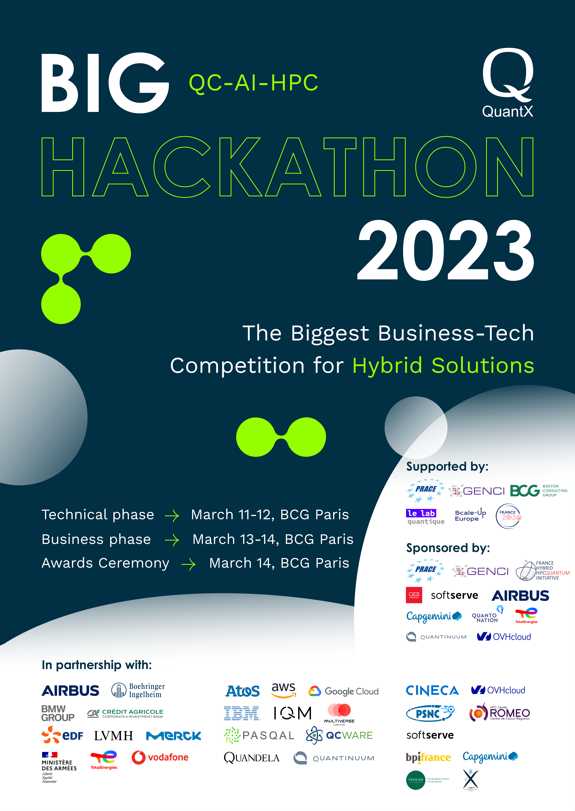

# BIG QC-AI-HPC Hackathon by Quantx - March 2022

Dear participants,

The BIG QC-AI-HPC Hackathon by QuantX, the first-of-a-kind competition, aims to gather the whole value chain of Artificial Intelligence, Quantum and High Performance Computing to demonstrate the ability of hybrid technology to address real-life challenges. During the event, the business world, represented by industrial and financial companies, VC/PE investors, and consulting groups, will join forces with the scientific computing specialists from academia, leading quantum providers, and HPC centres to approach a set of longstanding problems from different domains: chemistry, machine learning, optimization, numerical simulations, to name a few. Through establishing a stage for collaborative problem solving, the BIG QC-AI-HPC Hackathon will help the participants to investigate the real impact of their work, today’s viability of hybrid solutions, existing business interest, and efforts to be done in the coming years.

The BIG QC-AI-HPC Hackathon is organized under the high patronage of Neil Abroug - <em> the Head of the French National Quantum Strategy </em>. It is supported by <b>PRACE</b> - the Partnership for Advance Computing in Europe, <b>GENCI</b> - the French research infrastructure in charge of implementing national policy in HPC, AI and QC, <b>Boston Consulting Group</b> - a global consulting firm that partners with leaders in business and society to tackle their most important challenges, and <b>Le Lab Quantique</b> - the Paris-based think tank and network of bottom-up initiatives promoting quantum technologies.
